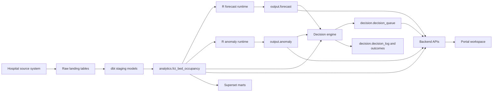

# Bed Pressure Intelligence Architecture

## Purpose

Bed Pressure Intelligence helps hospital operations teams see current ward pressure, anticipate capacity breaches, detect unusual occupancy patterns, and route human-authorised operational decisions. The use case is built as a portable pattern with five layers:

- Source layer: hospital bed management data for wards, patients, and bed events.
- dbt layer: raw source contracts, staging normalization, analytics marts, and Superset-facing tables.
- Runtime layer: R services for occupancy forecasting and anomaly detection.
- Decision layer: backend rules that generate, assign, execute, audit, and measure decisions.
- Portal layer: React workspace pages for status, predictions, analysis, and decisions.

## End-To-End Flow

## Platform Components

- Database: PostgreSQL-compatible schemas named `raw`, `staging`, `analytics`, `output`, and `decision`.
- Ingestion: any connector that can land source tables into the raw schema. The current OpenCare deployment uses Airbyte from hospital MySQL.
- Transform: dbt models under `dbt/opencare/models`.
- Runtime: containerized R Plumber services for forecast and anomaly refresh.
- API: FastAPI backend exposing `/api/v1` endpoints.
- Frontend: Next.js portal under `/use-cases/bed-pressure`.
- BI: Apache Superset dashboards backed by analytics marts.
- Scheduler: Kubernetes CronJobs or equivalent scheduler for dbt, R runtimes, and decision jobs.

## Canonical Implementation Paths

- Bundle contract: `usecases/bed-pressure`
- Source config: `config/use_cases.yaml`
- dbt sources: `dbt/opencare/models/sources.yml`
- dbt staging: `dbt/opencare/models/staging`
- dbt marts: `dbt/opencare/models/marts`
- Forecast runtime: `r-runtime/bed-forecast`
- Anomaly runtime: `r-runtime/anomaly`
- Runtime manifests: `manifests/runtimes`
- Decision manifests: `manifests/decisions`
- Backend routes: `apps/backend/app/routes`
- Portal routes: `apps/portal/app/use-cases/bed-pressure`
- Portal components: `apps/portal/components/bed-pressure`

## Minimum Fresh Install Sequence

1. Land raw source tables in the configured raw schema.
2. Run dbt source tests and staging models.
3. Run analytics marts, especially `analytics.fct_bed_occupancy`.
4. Deploy R runtime services and run `/run` on forecast and anomaly.
5. Deploy backend API and verify occupancy, forecast, anomaly, and decision endpoints.
6. Run the decision generator to populate `decision.decision_queue`.
7. Deploy portal and Superset dashboards.
8. Validate governance, lineage, freshness, and dashboard acceptance checks.
