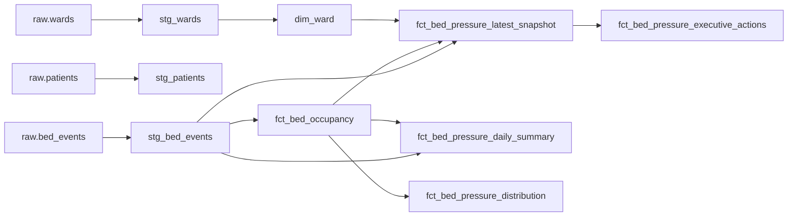

# dbt Model Contract

## Model Flow

## Raw Layer

The raw layer is declared in `dbt/opencare/models/sources.yml`. It documents freshness, ownership, classification, and source tests for `wards`, `patients`, and `bed_events`.

Key expectations:

- `raw.bed_events.event_id`, `event_timestamp`, `ward_id`, and `event_type` are not null.
- `raw.wards.ward_id`, `ward_code`, and `ward_name` are not null.
- Patient identifiers are high-sensitivity and should not be exposed in public dashboard tables.

## Staging Layer

### `stg_bed_events`

Purpose: normalize event fields and deduplicate repeated source rows.

Transformations:

- Casts `event_id` to `bed_event_key`.
- Casts `event_timestamp` to timestamp and derives `event_date`.
- Normalizes `event_type` with lower-case trim.
- Casts bed counts to integers.
- Removes duplicate events by keeping the latest row per `event_id`.
- Calculates `occupancy_rate = occupied_beds / staffed_beds` when `staffed_beds > 0`.

Grain: one deduplicated bed event.

### `stg_wards`

Purpose: normalize ward reference fields.

Transformations:

- Casts `ward_id` to text.
- Trims `ward_code`, `ward_name`, and `service_line`.
- Casts capacity fields to integers.

Grain: one ward.

### `stg_patients`

Purpose: normalize patient reference fields for governed source completeness.

Grain: one patient.

## Analytics Layer

### `analytics.fct_bed_occupancy`

Purpose: governed occupancy fact used by the portal, runtimes, and decisions.

Logic:

- Filters `stg_bed_events` to `event_type = 'midnight_census'`.
- Groups by `date_day` and `ward_id`.
- Uses max observed bed counts and occupancy rate for the ward-day.
- Calculates `available_beds = greatest(staffed_beds - occupied_beds, 0)`.
- Sets `pressure_flag = true` when `occupancy_rate >= 0.90`.

Grain: one ward per day.

### `analytics.fct_bed_pressure_daily_summary`

Purpose: network-level trend and executive summary.

Metrics:

- Network occupied, staffed, and available beds.
- Network occupancy percentage.
- Average and peak ward occupancy percentage.
- Critical, warning, and normal ward counts.
- Admissions, discharges, and net flow.

Grain: one day.

### `analytics.fct_bed_pressure_latest_snapshot`

Purpose: latest ward-level operational state.

Metrics:

- Ward, specialty, occupied beds, staffed beds, available beds.
- Current occupancy percentage.
- Same-day admissions, discharges, and net flow.
- Pressure band: `Critical` at 90 percent or above, `Warning` at 75 to under 90 percent, otherwise `Normal`.

Grain: one ward for the latest date in `fct_bed_occupancy`.

### `analytics.fct_bed_pressure_distribution`

Purpose: ward-day distribution table for BI comparisons and pressure plots.

Grain: one ward per day.

### `analytics.fct_bed_pressure_executive_actions`

Purpose: Superset-ready escalation board.

This model converts latest ward pressure into executive action fields and display-safe HTML columns for badge and meter rendering.

Rules:

- Occupancy at or above 95 percent: critical, CEO escalation, bed manager, target today.
- Occupancy at or above 85 percent: warning, operational intervention, site manager, target 24 hours.
- Otherwise: normal, routine monitoring, ward lead, routine.

Display columns:

- `risk_level_badge`
- `executive_priority_badge`
- `issue_badge`
- `required_action_badge`
- `owner_badge`
- `target_time_badge`
- `current_occupancy_display`
- `available_beds_display`

These columns are intended for Superset table visualizations with HTML rendering enabled. If the BI platform does not support HTML cells, use the plain text columns and apply conditional formatting in the BI layer.

## Runtime Input Contract

The R forecast and anomaly services read `analytics.fct_bed_occupancy`. Do not change its key columns without updating runtime SQL:

- `date_day`
- `ward_id`
- `occupied_beds`
- `staffed_beds`
- `available_beds`
- `occupancy_rate`

## Tests and Acceptance

Minimum dbt checks for a portable implementation:

- Raw not-null tests pass for source keys and timestamps.
- Staging deduplication produces one row per `bed_event_key`.
- `fct_bed_occupancy` has one row per `date_day` and `ward_id`.
- `available_beds` is never negative.
- `occupancy_rate` is between 0 and a locally accepted surge ceiling.
- Latest snapshot returns at least one ward.
- Executive actions table returns all required display and plain-text fields.
