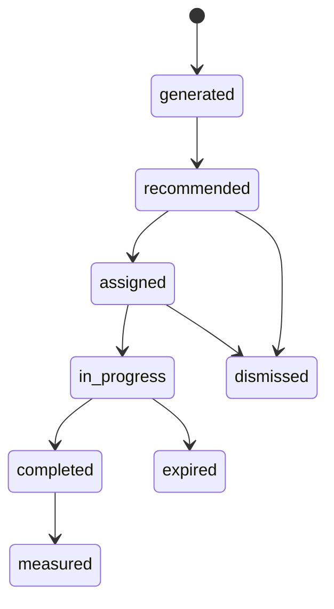

# Decision Workflow

## Purpose

The decision layer turns occupancy signals into human-authorised operational work. It does not act autonomously. It creates recommended decisions, tracks ownership and state, records audit events, sends notifications, and measures whether the action reduced pressure.

## Decision Types

| Decision type | Trigger | Owner | Expected outcome |
| --- | --- | --- | --- |
| `expedite_discharge` | Occupancy at or above 90 percent | Ward Lead | Release staffed beds through discharge-ready patient review |
| `activate_surge` | Occupancy at or above 95 percent or forecast breach within 12 hours | Capacity Command | Open overflow capacity and redirect non-urgent admissions |
| `defer_elective` | Occupancy at or above 90 percent and forecast breach within 24 hours | Site Operations | Preserve capacity by adjusting planned admission timing |
| `escalate_to_manager` | Critical anomaly, occupancy at or above 85 percent, and rising trend | Site Manager | Accelerate management review |

## Data Inputs

Decision generation reads:

- `analytics.fct_bed_occupancy` for current occupancy and pressure.
- `output.forecast` for predicted breach risk.
- `output.anomaly` for critical or unusual occupancy signals.

Decision generation writes:

- `decision.decision_queue`
- `decision.decision_log`
- `decision.notification_log`

Outcome measurement writes:

- `decision.decision_outcomes`

## Lifecycle States

Canonical states:

- `generated`
- `recommended`
- `assigned`
- `in_progress`
- `completed`
- `dismissed`
- `expired`
- `measured`

Required path for operational actions:

## Action Rules

- A decision may not be completed without action evidence or an execute-all confirmation.
- External actions require human authorisation.
- Decision logs are append-only.
- Demo fallback rows must not write audit events.
- Outcome measurement runs after the configured observation delay.
- Duplicate active decisions are suppressed for the same use case, entity, and decision type.
- Recently completed decisions are subject to a cooldown window.

## Outcome Measurement

The backend measures completed decisions against later occupancy evidence. It compares predicted occupancy after the decision with actual occupancy after the observation window and stores the result in `decision.decision_outcomes`.

Outcome fields include:

- Predicted beds released.
- Predicted occupancy after action.
- Predicted risk after action.
- Actual beds released where observable.
- Actual occupancy after action.
- Actual risk after action.
- Prediction accuracy and measurement status.

## Porting Rules

- Keep the decision queue separate from forecast and anomaly outputs.
- Keep action mutation endpoints authenticated.
- Record every state transition in an audit table.
- Preserve decision IDs across queue, log, notifications, and outcomes.
- Do not let the intelligence or forecast page authorise actions; only the decision surface should mutate decisions.
