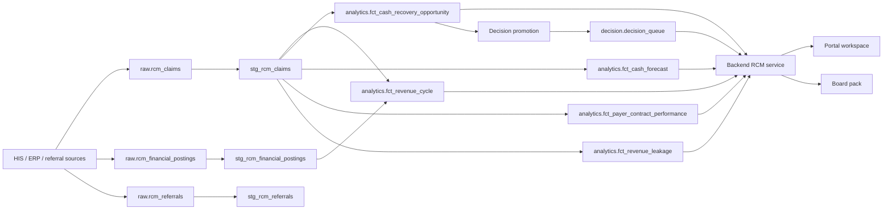

# Revenue Cycle Management Architecture

## Purpose

Revenue Cycle Management turns hospital financial operations into a governed execution loop: cash command, recovery work, payer accountability, leakage detection, decision approval, team performance, and board reporting.

## End-To-End Flow

## Platform Components

- Database schemas: `raw`, `staging`, `analytics`, and `decision`.
- Ingestion: any connector that lands claims, financial postings, and referrals.
- Transform: dbt revenue-cycle staging and mart models.
- Runtime logic: backend service calculations in `revenue_cycle_service.py`.
- API: FastAPI routes under `/api/v1/revenue-cycle` and `/api/v1/rcm`.
- Portal: Next.js workspace under `/use-cases/revenue-cycle-management`.
- Report: downloadable board pack generated from `/api/v1/rcm/board-pack`.
- BI: Superset dashboard backed by revenue-cycle marts.

## Current Runtime Position

Unlike Bed Pressure, RCM does not currently use a separate R forecasting or anomaly runtime. Forecast and decision-support calculations are deterministic dbt/backend logic. The golden structure still has a `runtime` folder to make this explicit and portable.
