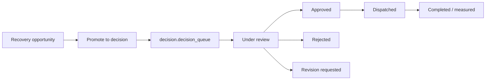

# Decision Workflow

## Purpose

The RCM decision layer promotes recovery opportunities into governed financial actions. It lets users review evidence, approve, reject, revise, dispatch, escalate, assign, and audit decisions.

## Promotion Flow

## Source Decision Evidence

Promoted decisions come from `analytics.fct_cash_recovery_opportunity`.

Evidence includes:

- Claim ID.
- Payer ID.
- Department ID.
- Issue type.
- Recoverable amount.
- Expected recovery.
- Required action.
- Owner team.
- Due date.
- Evidence summary.

## Action Rules

- Recovery items must be promoted before becoming governed decisions.
- Approval is required before dispatch.
- Notes and assignments are audit events.
- Decision pages may mutate decisions; cash, payer, leakage, and board-pack pages may not.
- Decisions must remain traceable to the source recovery opportunity.
